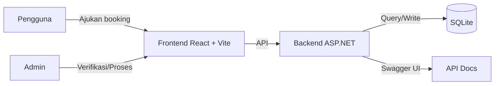
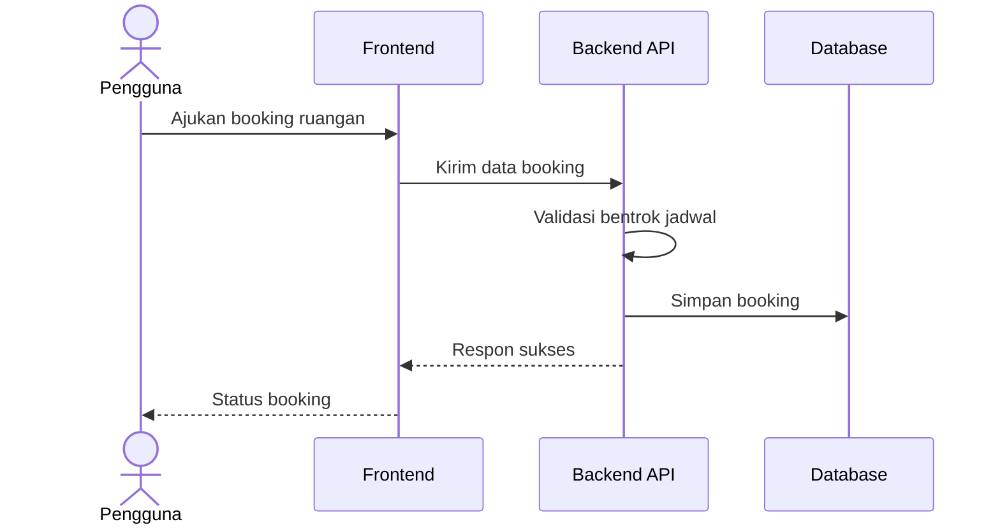

# Arsitektur Sistem SIPERU

Dokumen ini menjelaskan arsitektur sistem SIPERU untuk peminjaman/booking ruangan kampus.

## Ringkasan
SIPERU adalah sistem peminjaman ruangan. Pengguna mengajukan booking, admin memverifikasi, dan sistem menjaga ketersediaan jadwal agar tidak bentrok.

## Tujuan Arsitektur
- Skalabel untuk beban permohonan yang fluktuatif.
- Mudah dirawat dengan pemisahan tanggung jawab antar layanan.
- Aman dengan autentikasi, otorisasi, dan audit trail.
- Terukur dengan logging terpusat dan monitoring.

## Batasan
- Dokumen ini berfokus pada arsitektur logis dan alur data.
- Detail teknis implementasi ada di dokumen SDD.

## Diagram Konteks

## Komponen Utama
- Frontend (React + Vite). Dashboard admin dan UI pengguna.
- Backend API (ASP.NET Core). Logika bisnis booking dan validasi bentrok jadwal.
- Database (SQLite). Penyimpanan data ruang dan booking.
- Swagger UI. Dokumentasi API.

## Alur Utama Booking

## Arsitektur Logis
- Layer Presentasi. Frontend React + Vite.
- Layer Layanan. Backend API ASP.NET Core.
- Layer Data. SQLite untuk data ruangan dan booking.

## Observabilitas
- Logging di Backend API.
- Swagger UI untuk eksplorasi endpoint.

## Risiko dan Mitigasi
- Lonjakan trafik. Gunakan cache dan autoscaling.
- Kualitas data. Validasi berlapis di frontend dan backend.
- Ketersediaan. Backup terjadwal dan strategi recovery.

## Catatan
Silakan lengkapi nama layanan, teknologi, dan detail integrasi sesuai implementasi aktual.
