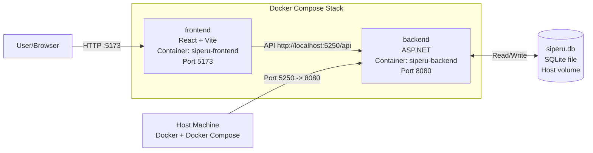

# SDD Infrastruktur SIPERU

## Ringkasan Desain
Repo infrastruktur menjalankan backend dan frontend menggunakan Docker Compose untuk setup lokal.

## Topologi
- Docker Compose dengan dua service utama: backend dan frontend.
- Port lokal backend: `http://localhost:5250`.
- Port lokal frontend: `http://localhost:5173`.

## Keamanan
- Variabel environment disimpan di `.env` (tidak di-commit).

## Observabilitas
- Logging via `docker compose logs -f`.

## Backup dan Recovery
- Persistensi database menggunakan volume.

## CI/CD
- GitHub Actions CI memvalidasi file yang dibutuhkan.

## Catatan Implementasi
- Struktur folder sibling: `../2026-siperu-backend`.
- Struktur folder sibling: `../2026-siperu-frontend`.
- Struktur folder sibling: `./2026-siperu-infrastructure` (repo ini).
- Env: `ASPNETCORE_ENVIRONMENT` (default `Development`).
- Env: `VITE_API_URL` (default `http://localhost:5250/api`).

## Diagram Deployment

Catatan:
- Port `5250` di host dipetakan ke port `8080` di container backend.
- Frontend berjalan di port `5173`.
- Database menggunakan file `siperu.db` yang di-mount dari host agar persisten.
    